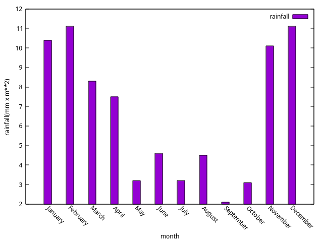

# fex3
## fortran examples on general topics
The following instructions are to
compile and run the program on linux terminal
or importing the project in an IDE that
accept Makefile based projects.
###
To create all the executables:
`make`
### bookcat
This program read a book catalog, contained in the
file books.txt and load it in memory, showing it on the screen.
It is possible to search entries of a given author
typing the author name and pushing enter.
Follow the instructions on the console.
To create only this program
`make bookcat`
To execute it
`./bookcat`
### exams
To create only this program
`make exams`
To execute it
`./exams`
This program reads a table of the marks of students
at exams on different subjects. The table is contained
in the file exams.txt that can be also created by the program.
When the table is in memory is possible to inquire the
database giving the couple separated by comma
(<student>,<subject-code>)
and having as result the mark of that student in the
given subject exam.
Follow the instructions on the console.
### repd
To create only this program
`make repd`
To execute it
`./repd`
This program reads a phone directory from a file
called phonedir.csv
containing a list of contacts
and the prints it out on the terminal screen.
### rain
This program reads a file rainfall.txt with data on rainfall
in different months of the year. It computes the monthly rain
average and create a histogram plot of the rainfall during the year.
To run and create a plot on screen with linux
`make plot`
 (needs gnuplot installed)

