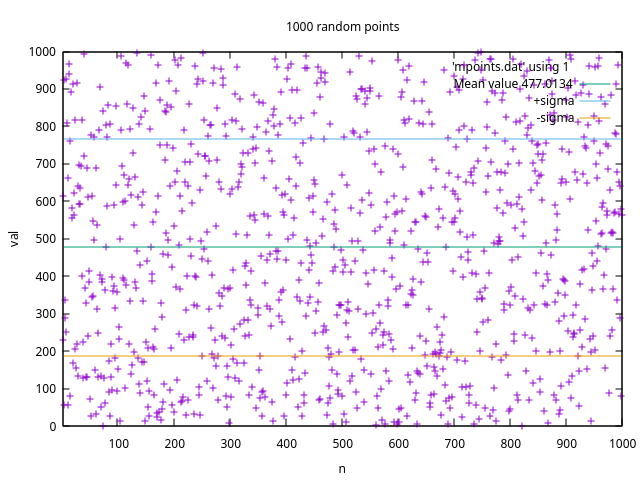

# fex3
## fortran examples on general topics
Ths source code is written in
FORTRAN 77 standard (ANSI/ISO).
The following instructions are to
compile and run the program on linux terminal
or importing the project in an IDE that
accept Makefile based projects.
The programs has beem compiled and tested
both on Microsoft Windows OS (using mingw gfortran compiler and
salford/silverfrost FTN77 compiler). To compile
using makefiles gnu `make` (gmake) on linux or
mingw `mingw32-make` on MS Windows.
###
To create all the executables:
`make`
### bookcat
This program read a book catalog, contained in the
file books.txt and load it in memory, showing it on the screen.
It is possible to search entries of a given author
typing the author name and pushing enter.
Follow the instructions on the console.
To create only this program
`make bookcat`
To execute it
`./bookcat`
### exams
To create only this program
`make exams`
To execute it
`./exams`
This program reads a table of the marks of students
at exams on different subjects. The table is contained
in the file exams.txt that can be also created by the program.
When the table is in memory is possible to inquire the
database giving the couple separated by comma
(<student>,<subject-code>)
and having as result the mark of that student in the
given subject exam.
Follow the instructions on the console.
### repd
To create only this program
`make repd`
To execute it
`./repd`
This program reads a phone directory from a file
called phonedir.csv
containing a list of contacts
and the prints it out on the terminal screen.
### rain
This program reads a file rainfall.txt with data on rainfall
in different months of the year. It computes the monthly rain
average and create a histogram plot of the rainfall during the year.
To run and create a plot on screen with linux
`make plot`
 (needs gnuplot installed)

###
To remove all the generated files:
`make clean`
###
### bconvert
###
To execute it on linux: `./bconvert` . This program takes in input a decimal number in (0,15) and gives in output the string
of the binary number, performing the conversion. After that it asks in input a hexadecimal number in (0,F) and gives
back the binary string of 1s and 0s of the same number
### bytes
###
To execute it on linux:`./bytes` . This program takes in input 8 characters of the 8 digits of a zero filled (to the left)
hexadecimal number (es. 000AB716) and gives in output: 1) The decimal value of every hex character (nibble). 2) The hexadecimal
number without left padding zeros. 
### createpoints
###
To execute it on linux `./createpoints` .This program create a file of random points that will go in input to the program stats
to do some statistics. It takes in input the number of points and the file name.
### crtpntftn77
###
To execute it on MS Windows `createpoints` .I developed a different version to be with the silverfrost/salford ftn77 compiler
because the random generator functions are not standard and has different names respect to gfortran.
This program create a file of random points that will go in input to the program stats
to do some statistics. It takes in input the number of points and the file name.
### stats.f
To execute it on linux `./stats` .This program reads a succession of 1-D points from a file like those generated by the program
createpoints (es. points.dat) and calculate the mean, the variance and the standard deviation (both population and sampl -1/N 1/(N-1)-)

###
### dimtest
###
### directfileio
###
### es1.f
###
### loadwritearray.f
###
### loan
###
### reduce.f
###
### testf.f
###
### writereadform.f
